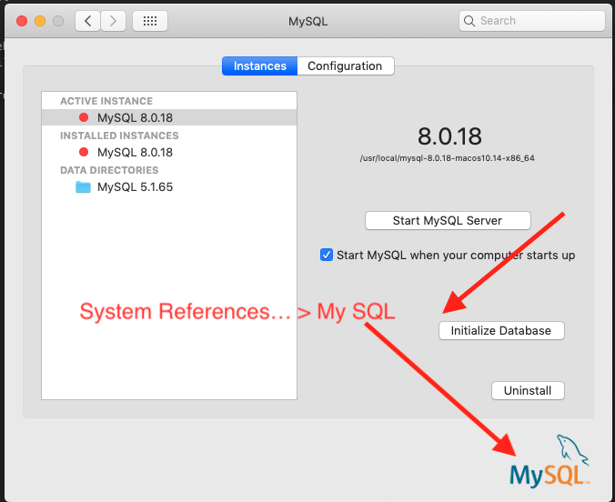

# Pre-Request

## MySQL
[download website](https://dev.mysql.com/downloads/mysql/)
[download file](mysql-8.0.18-macos10.14-x86_64.dmg)
[MD5: ](MD5: 6effb5f8b4a06546b72c1f041d3d70bd)
root password: root

###Download MySQL Workbench
[download workbench](https://dev.mysql.com/downloads/workbench/)