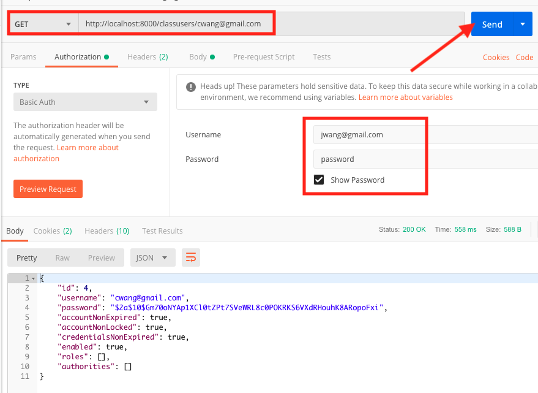

# Video Course

## Login & Encrypted Password


## Build

Right-click project name, select (Run As) -> (Maven build) -> (Goal=jar:jar)

## Notice
1. folder name should be same as project name which are defined in .project and pom.xml files;

## Run
1. Make sure MySQL server is up and runing
2. Make sure there is lesson schema created on MySQL database
3. Make sure the root username and password are correct in application.properties file
4. Run VideoCourseApplication.java as Java Application 
5. This application need valid user login, and the password is encrypted.
>to get encrypted password, debug unit test: ClassUserTest.java
encrypt("password") = $2a$10$Gm70oNYAp1XCl0tZPt7SVeWRL8c0POKRKS6VXdRHouhK8ARopoFxi
6. Check the application start correctly
> [call login service](http://localhost:8000/login)
Login as existing user: jwang@gmail.com/password (Make sure this user is stored in the lesson/class_user table in MySQL database.
[Test service /hello](http://localhost:8000/hello)
7. Postman

[Test Get classuser](http://localhost:8000/classusers/cwang@gmail.com)

[Test Post to Create an user](http://localhost:8000/classusers with Body) Failed. 403 Forbidden.

[Test Get All lectures](http://localhost:8000/lectures) Failed: Not Found.
```json
{
    "timestamp": "2019-11-19T22:34:38.890+0000",
    "message": "Unable to find com.wang.video.course.entity.Section with id 2; nested exception is javax.persistence.EntityNotFoundException: Unable to find com.wang.video.course.entity.Section with id 2",
    "details": "uri=/lectures"
}
```
this is because the request parameters passed wrong.

[Test Get a lecture by topic_id=1, section_id=1](http://localhost:8000/topics/1/sections/1)

[Test Get a lecture by topic_id=1, section_id=1](http://localhost:8000/topics/1/sections/1/lectures/3)

## Security
[Implementation Reference](https://grokonez.com/spring-framework/spring-mvc/spring-security-config-security-mvc-web-spring-boot)

[Test Get all topics](http://localhost:8000/topics)

[Test Get all sections](http://localhost:8000/sections)

[/, /home without valid login](http://localhost:8000)

[/sectios, /topics without login](http://localhost:8000/sections)

[/login with user/user or admin/admin](http://localhost:8000/user, http://localhost:8000/admin)